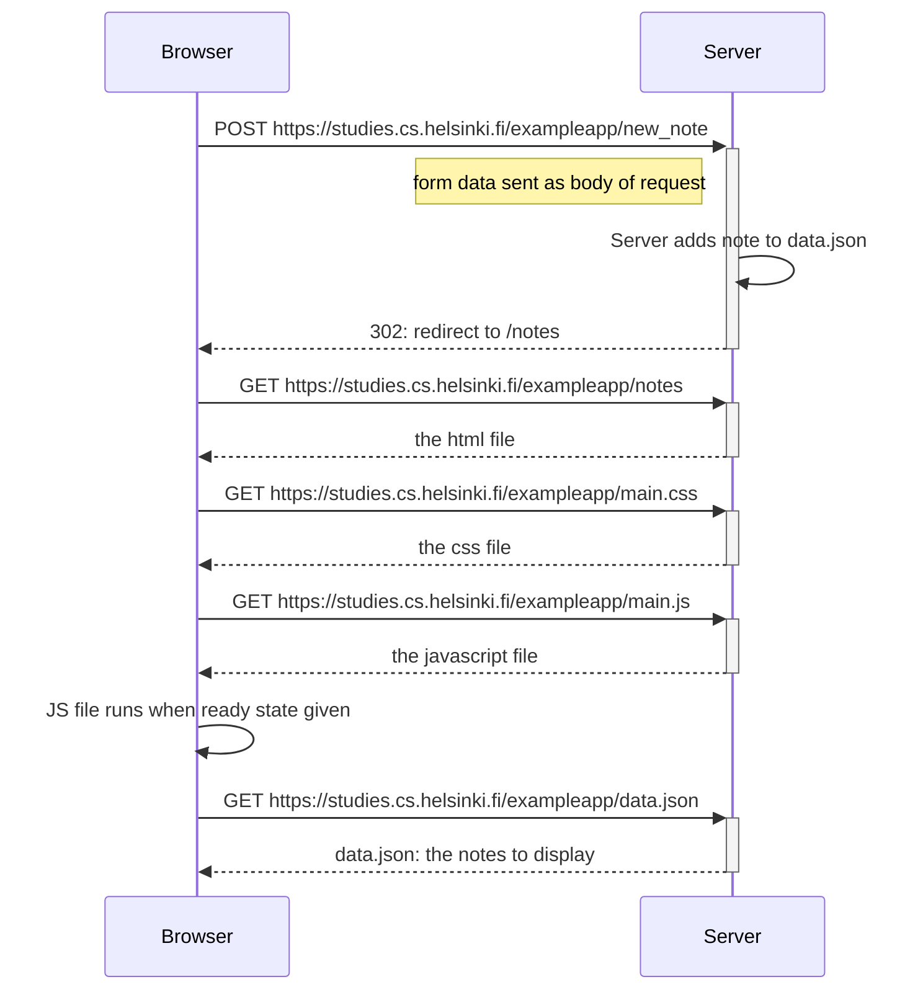

```mermaid

sequenceDiagram
    participant B as Browser
    participant S as Server

    B->>+S: POST https://studies.cs.helsinki.fi/exampleapp/new_note
    Note left of S: form data sent as body of request
    S->>S: Server adds note to data.json
    S-->>-B: 302: redirect to /notes

    B->>+S: GET https://studies.cs.helsinki.fi/exampleapp/notes
    S-->>-B: the html file

    B->>+S: GET https://studies.cs.helsinki.fi/exampleapp/main.css
    S-->>-B: the css file

    B->>+S: GET https://studies.cs.helsinki.fi/exampleapp/main.js
    S-->>-B: the javascript file
    B->>B: JS file runs when ready state given
    B->>+S: GET https://studies.cs.helsinki.fi/exampleapp/data.json
    S-->>-B: data.json: the notes to display
```