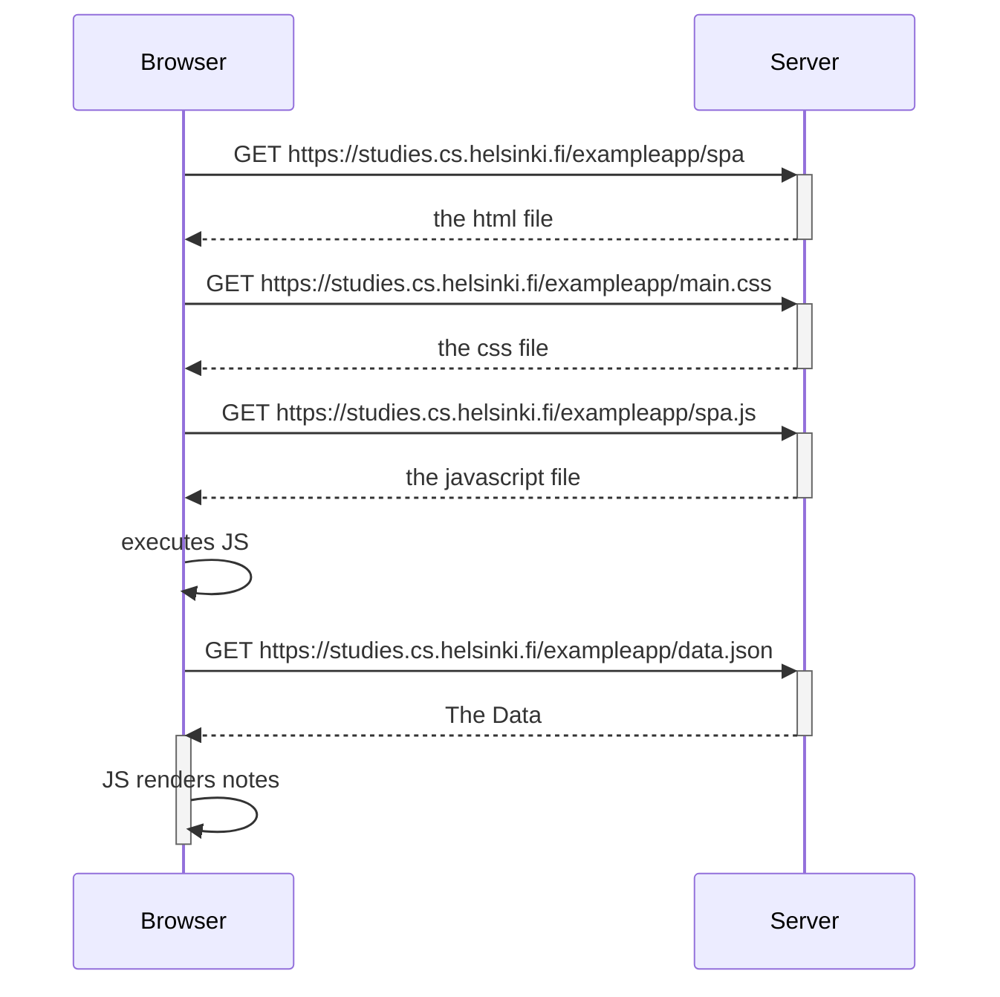

```mermaid
sequenceDiagram
    participant B as Browser
    participant S as Server

    B->>+S: GET https://studies.cs.helsinki.fi/exampleapp/spa
    S-->>-B: the html file
    B->>+S: GET https://studies.cs.helsinki.fi/exampleapp/main.css
    S-->>-B: the css file
    B->>+S: GET https://studies.cs.helsinki.fi/exampleapp/spa.js
    S-->>-B: the javascript file
    B->>B: executes JS
    B->>+S: GET https://studies.cs.helsinki.fi/exampleapp/data.json
    S-->>-B: The Data
    activate B
    B->>B: JS renders notes
    deactivate B
```