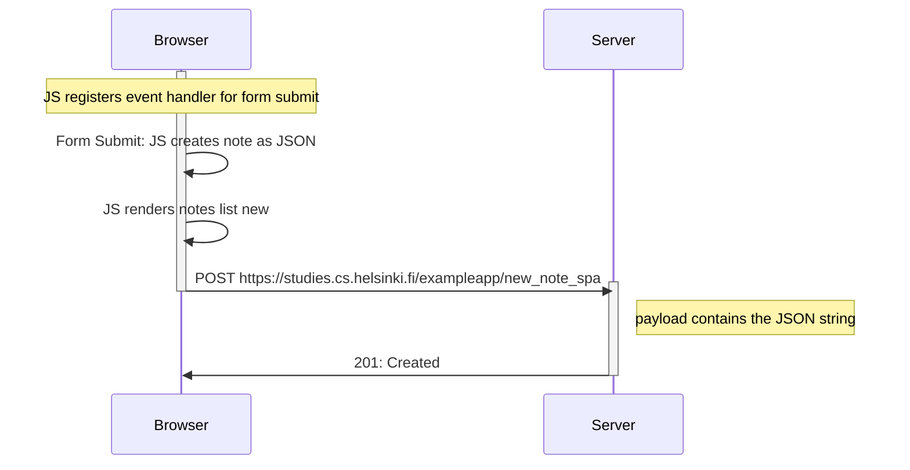

```mermaid
sequenceDiagram
    participant B as Browser
    participant S as Server

    activate B
    Note over B: JS registers event handler for form submit
    B->>B: Form Submit: JS creates note as JSON
    B->>B: JS renders notes list new
    B->>S: POST https://studies.cs.helsinki.fi/exampleapp/new_note_spa
    activate S
    deactivate B
    Note right of S: payload contains the JSON string
    S->>B: 201: Created
    deactivate S
```